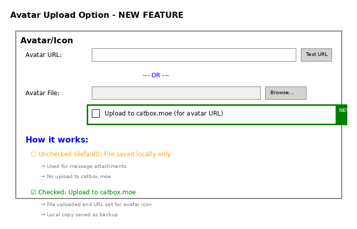

# Avatar Upload Option - Feature Update

## Overview

Added a new checkbox option to control whether avatar files are uploaded to catbox.moe or just saved locally.

## The Problem (Before)

Previously, when you selected an avatar file and clicked "Add Character" or "Update Selected":
- The file was **automatically** uploaded to catbox.moe
- This always happened, even if you didn't want to upload
- Uploading the same file multiple times could cause errors
- No way to use just local files without uploading

## The Solution (Now)

Now there's a checkbox: **"Upload to catbox.moe (for avatar URL)"**



### Option 1: Unchecked (Default) - Local Only
When the checkbox is **unchecked**:
- ✓ File is saved to `character_avatars/` folder
- ✓ Used for message attachments (file appears in message)
- ✓ No upload to catbox.moe
- ✓ No internet connection needed
- ✓ avatar_url field remains empty
- ✓ avatar_file field contains local path

**Use this when:**
- You want to keep files local
- You don't need a custom avatar icon
- You want the image attached to messages

### Option 2: Checked - Upload to Catbox
When the checkbox is **checked**:
- ✓ File is uploaded to catbox.moe
- ✓ URL is returned and set in avatar_url field
- ✓ Local copy still saved as backup
- ✓ Avatar appears as webhook icon in Discord
- ✓ Both avatar_url and avatar_file are set

**Use this when:**
- You want a custom avatar icon for the character
- You want the avatar to appear next to the username
- You're okay with uploading to a public hosting service

## How to Use

### Adding a New Character

1. Fill in character details (name, display name, description)
2. Click "Browse..." to select an avatar image file
3. **NEW**: Check or uncheck "Upload to catbox.moe"
   - Leave unchecked for local-only
   - Check it to upload and get avatar URL
4. Click "Add Character"

### Updating an Existing Character

1. Select a character and click "Edit Selected"
2. Make your changes
3. If changing avatar file:
   - Click "Browse..." to select new file
   - **NEW**: Check or uncheck "Upload to catbox.moe"
4. Click "Update Selected"

## Technical Details

### File Handling Logic

**When Upload is Unchecked:**
```python
# File is only copied locally
avatars_dir = "character_avatars"
avatar_file_dest = os.path.join(avatars_dir, f"{name}{file_ext}")
shutil.copy2(avatar_file_source, avatar_file_dest)
# avatar_url remains empty
```

**When Upload is Checked:**
```python
# File is uploaded to catbox.moe
uploaded_url = self.upload_to_catbox(avatar_file_source)
if uploaded_url:
    avatar_url = uploaded_url  # Set the URL
    # Still save locally as backup
    shutil.copy2(avatar_file_source, avatar_file_dest)
```

### Preventing Duplicate Upload Errors

The update logic now checks:
1. Is this a different file from what's currently stored? (`avatar_file_source != current_avatar_file`)
2. Do we already have a URL for this file? (`current_avatar_url`)

Only uploads if:
- It's a new/different file, OR
- There's no existing avatar URL

This prevents the error: *"filename and filename are the same file"*

## Benefits

✓ **User Control**: You decide when to upload  
✓ **No Automatic Uploads**: Upload only happens when you explicitly check the box  
✓ **Local-First Option**: Can work completely offline  
✓ **Prevents Errors**: No duplicate upload errors  
✓ **Clear Intent**: Checkbox makes it obvious what will happen  
✓ **Both Options Available**: Can use local files OR URLs as needed  

## Applies To

This feature is available in:
- ✓ Characters tab (regular characters)
- ✓ User Characters tab (user personas)

Both tabs have the same checkbox and behavior.

## Migration

Existing characters are not affected. The checkbox only applies when:
- Adding a new character with an avatar file
- Updating an existing character with a new avatar file

Existing avatar_url and avatar_file values are preserved.
